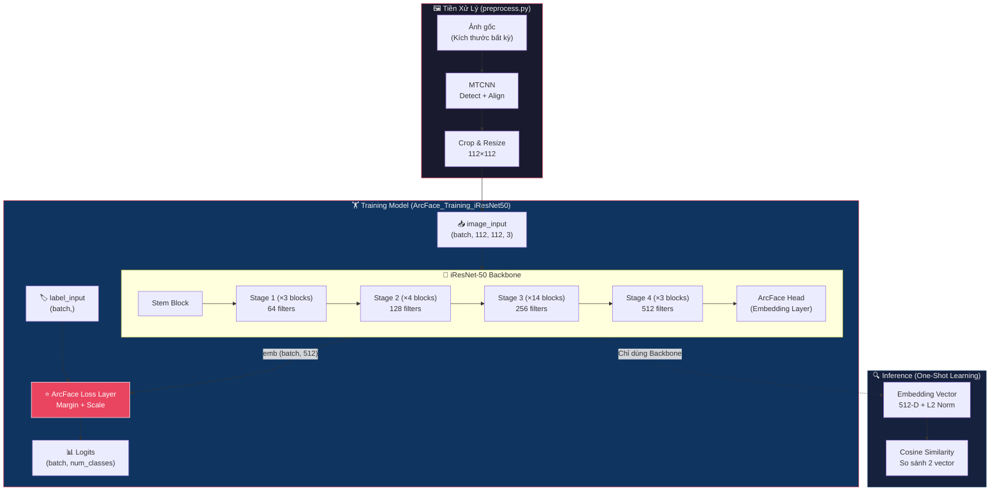
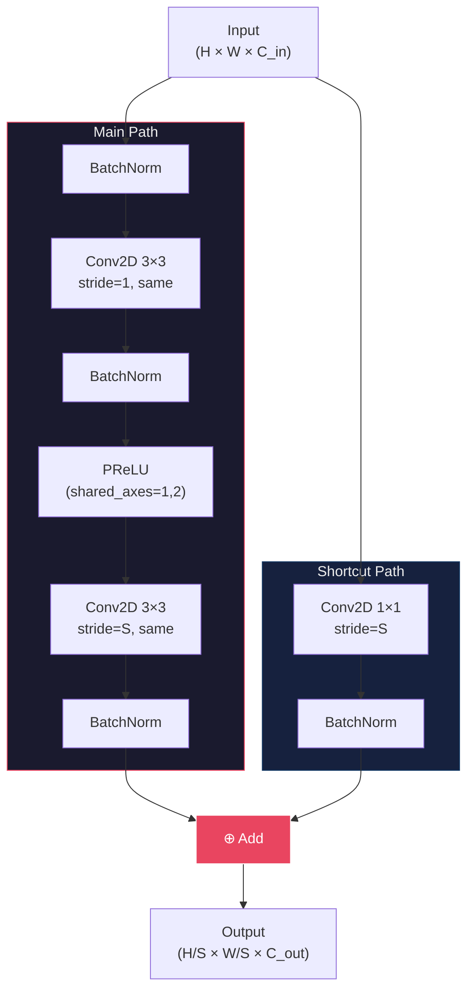
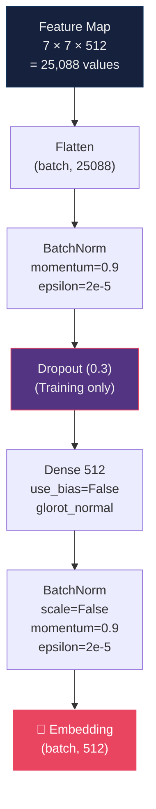
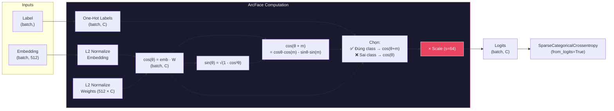

# Kiến trúc mô hình: iResNet-50 + ArcFace Head

> **Source file:** `training/face_recognition/iresnet50.py`
> **Tổng tham số:** ~43.7M | **Input:** 112×112×3 | **Output Embedding:** 512-D

---

## 1. Tổng quan kiến trúc (Full Pipeline)



---

## 2. Chi tiết từng khối (Block-by-Block)

### 2.1 Stem Block

| Thứ tự | Layer | Kernel | Stride | Output Shape | Params |
|--------|-------|--------|--------|-------------|--------|
| 1 | `Conv2D` (stem_conv) | 3×3, 64 | 1 | 112×112×64 | 1,728 |
| 2 | `BatchNorm` (stem_bn) | - | - | 112×112×64 | 256 |
| 3 | `PReLU` (stem_prelu) | - | - | 112×112×64 | 1 |

---

### 2.2 IR Block (Improved Residual Block)

Đây là đơn vị cơ bản được lặp lại 24 lần trong toàn bộ mạng.



> **Lưu ý:** Shortcut path chỉ có Conv2D 1×1 khi `stride ≠ 1` hoặc `C_in ≠ C_out` (tức block đầu tiên của mỗi Stage). Các block tiếp theo dùng Identity shortcut (nối thẳng).

---

### 2.3 Bốn Stage chi tiết

#### Stage 1 — 3 blocks × 64 filters

| Block | Stride | Input Shape | Output Shape | Shortcut |
|-------|--------|-------------|-------------|----------|
| `stage1_block1` | **2** | 112×112×64 | **56×56×64** | Conv 1×1 (stride=2) |
| `stage1_block2` | 1 | 56×56×64 | 56×56×64 | Identity |
| `stage1_block3` | 1 | 56×56×64 | 56×56×64 | Identity |

#### Stage 2 — 4 blocks × 128 filters

| Block | Stride | Input Shape | Output Shape | Shortcut |
|-------|--------|-------------|-------------|----------|
| `stage2_block1` | **2** | 56×56×64 | **28×28×128** | Conv 1×1 (stride=2) |
| `stage2_block2` | 1 | 28×28×128 | 28×28×128 | Identity |
| `stage2_block3` | 1 | 28×28×128 | 28×28×128 | Identity |
| `stage2_block4` | 1 | 28×28×128 | 28×28×128 | Identity |

#### Stage 3 — 14 blocks × 256 filters

| Block | Stride | Input Shape | Output Shape | Shortcut |
|-------|--------|-------------|-------------|----------|
| `stage3_block1` | **2** | 28×28×128 | **14×14×256** | Conv 1×1 (stride=2) |
| `stage3_block2` → `block14` | 1 | 14×14×256 | 14×14×256 | Identity (×13) |

#### Stage 4 — 3 blocks × 512 filters

| Block | Stride | Input Shape | Output Shape | Shortcut |
|-------|--------|-------------|-------------|----------|
| `stage4_block1` | **2** | 14×14×256 | **7×7×512** | Conv 1×1 (stride=2) |
| `stage4_block2` | 1 | 7×7×512 | 7×7×512 | Identity |
| `stage4_block3` | 1 | 7×7×512 | 7×7×512 | Identity |

---

### 2.4 ArcFace Head (Embedding Layer)

Phần cuối của Backbone, chuyển đổi feature map thành vector embedding 512 chiều.



| Thứ tự | Layer | Chi tiết | Output Shape | Params |
|--------|-------|----------|-------------|--------|
| 1 | `Flatten` | 7×7×512 → 25088 | (batch, 25088) | 0 |
| 2 | `BatchNorm` (bn_flatten) | momentum=0.9, ε=2e-5 | (batch, 25088) | 100,352 |
| 3 | `Dropout` | rate=0.3 (chỉ khi train) | (batch, 25088) | 0 |
| 4 | `Dense` (fc_embedding) | units=512, no bias | (batch, 512) | 12,845,056 |
| 5 | `BatchNorm` (bn_embedding) | scale=False, momentum=0.9 | (batch, 512) | 1,024 |

> **Tại sao `scale=False` ở BN cuối?**
> Vì ArcFace sẽ L2-normalize embedding, nên giá trị scale (γ) của BN là dư thừa. Bỏ đi giúp giảm tham số và tránh xung đột gradient.

---

## 3. ArcFace Loss Layer (Chỉ dùng khi Training)



### Công thức toán học:

$$\text{ArcFace}(x_i, y_i) = -\log \frac{e^{s \cdot \cos(\theta_{y_i} + m)}}{e^{s \cdot \cos(\theta_{y_i} + m)} + \sum_{j \neq y_i} e^{s \cdot \cos\theta_j}}$$

| Tham số | Giá trị | Mô tả |
|---------|---------|-------|
| `s` (scale) | 64 | Phóng đại gradient, giúp hội tụ nhanh |
| `m` (margin) | 0.0 → 0.5 | Tăng dần qua từng epoch (Progressive Margin) |
| `W` (weights) | 512 × num_classes | Ma trận trọng số đại diện cho từng class |

---

## 4. Tóm tắt luồng dữ liệu (Data Flow Summary)

```
Ảnh 112×112×3
    │
    ▼
┌─────────────────────────────────────────────┐
│  STEM: Conv2D(64, 3×3) → BN → PReLU        │  112×112×64
├─────────────────────────────────────────────┤
│  STAGE 1: IR Block × 3  (filters=64)       │  56×56×64
├─────────────────────────────────────────────┤
│  STAGE 2: IR Block × 4  (filters=128)      │  28×28×128
├─────────────────────────────────────────────┤
│  STAGE 3: IR Block × 14 (filters=256)      │  14×14×256
├─────────────────────────────────────────────┤
│  STAGE 4: IR Block × 3  (filters=512)      │  7×7×512
├─────────────────────────────────────────────┤
│  HEAD:                                      │
│    Flatten           → (25088)              │
│    BatchNorm         → (25088)              │
│    Dropout(0.3)      → (25088)              │
│    Dense(512)        → (512)                │
│    BatchNorm(γ=off)  → (512)   ← EMBEDDING │
└─────────────────────────────────────────────┘
    │
    ├── [Training] ──→ ArcFace(margin, scale=64) → Logits(num_classes) → Loss
    │
    └── [Inference] ──→ L2 Normalize → 512-D Vector → Cosine Similarity
```

---

## 5. So sánh với ResNet-50 gốc (ImageNet)

| Đặc điểm | ResNet-50 (ImageNet) | iResNet-50 (InsightFace) |
|-----------|---------------------|-------------------------|
| Input size | 224×224 | **112×112** |
| Stem | Conv 7×7 + MaxPool | **Conv 3×3 (no pool)** |
| Block type | Bottleneck (1×1→3×3→1×1) | **IR Block (3×3→3×3)** |
| Activation | ReLU | **PReLU** |
| Block structure | Conv → BN → ReLU | **BN → Conv → BN → PReLU → Conv → BN** |
| Stages (blocks) | [3, 4, 6, 3] = 16 | **[3, 4, 14, 3] = 24** |
| Output head | GAP → Dense(1000) | **Flatten → BN → Dropout → Dense(512) → BN** |
| Loss function | Softmax Cross-Entropy | **ArcFace (Angular Margin)** |
| Tối ưu cho | Phân loại tổng quát | **Trích xuất đặc trưng khuôn mặt** |

> **Tại sao không dùng MaxPool ở Stem?**
> Vì ảnh input chỉ 112×112, MaxPool sẽ mất quá nhiều thông tin spatial ngay từ đầu. iResNet dùng Conv stride=2 ở block đầu tiên của mỗi Stage để giảm kích thước một cách "mềm" hơn, giữ lại nhiều chi tiết khuôn mặt hơn.
