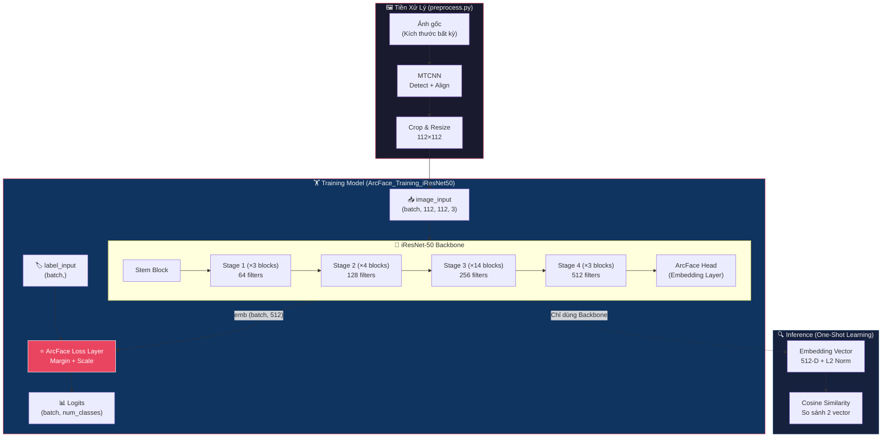
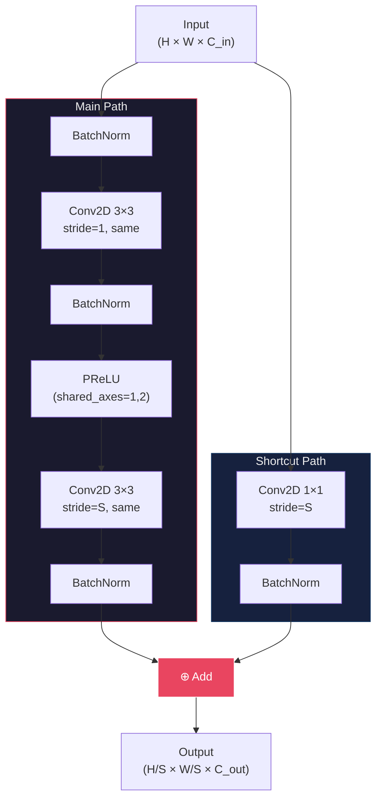
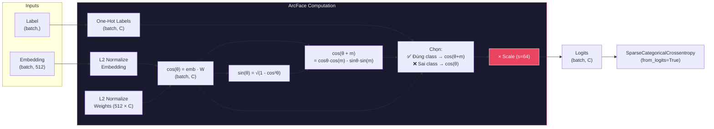
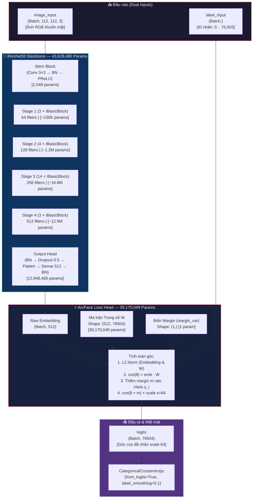
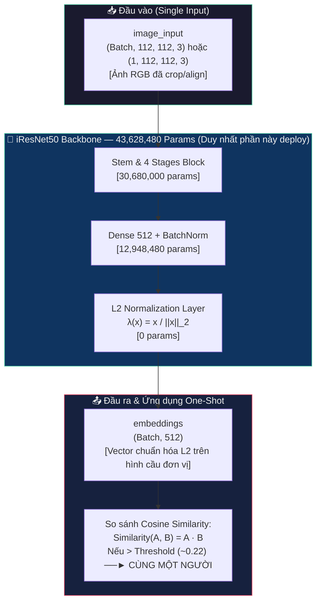
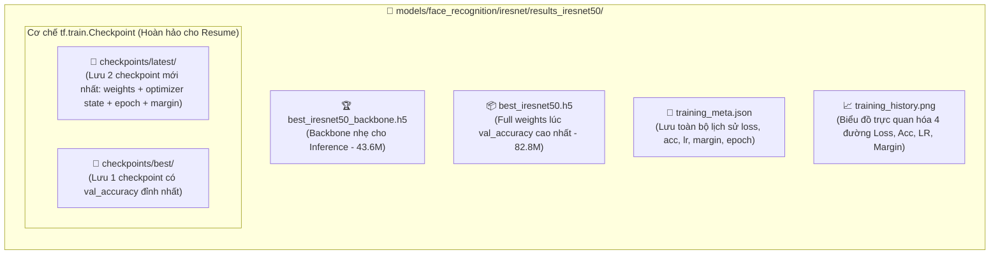
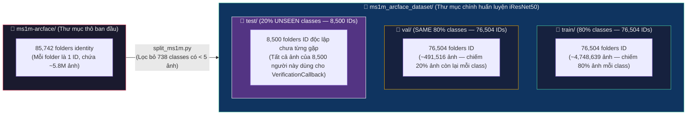

# Kiến trúc mô hình: iResNet-50 + ArcFace Head

> **Source files:** `models/face_recognition/iresnet/iresnet50.py`, `models/face_recognition/iresnet/train.py`, `models/face_recognition/iresnet/train_iresnet50_ms1m.ipynb`
> **Tổng tham số Backbone:** ~43.6M | **Params khi Train (ArcFace Head 76,504 classes):** ~82.8M | **Input:** 112×112×3 | **Output Embedding:** 512-D (L2-Normalized)

---

## 1. Tổng quan kiến trúc (Full Pipeline)



---

## 2. Chi tiết từng khối (Block-by-Block)

### 2.1 Stem Block

| Thứ tự | Layer | Kernel | Stride | Output Shape | Params |
|--------|-------|--------|--------|-------------|--------|
| 1 | `Conv2D` (stem_conv) | 3×3, 64 | 1 | 112×112×64 | 1,728 |
| 2 | `BatchNorm` (stem_bn) | - | - | 112×112×64 | 256 |
| 3 | `PReLU` (stem_prelu) | - | - | 112×112×64 | 1 |

---

### 2.2 IR Block (Improved Residual Block)

Đây là đơn vị cơ bản được lặp lại 24 lần trong toàn bộ mạng.



> **Lưu ý:** Shortcut path chỉ có Conv2D 1×1 khi `stride ≠ 1` hoặc `C_in ≠ C_out` (tức block đầu tiên của mỗi Stage). Các block tiếp theo dùng Identity shortcut (nối thẳng).

---

### 2.3 Bốn Stage chi tiết

#### Stage 1 — 3 blocks × 64 filters

| Block | Stride | Input Shape | Output Shape | Shortcut |
|-------|--------|-------------|-------------|----------|
| `stage1_block1` | **2** | 112×112×64 | **56×56×64** | Conv 1×1 (stride=2) |
| `stage1_block2` | 1 | 56×56×64 | 56×56×64 | Identity |
| `stage1_block3` | 1 | 56×56×64 | 56×56×64 | Identity |

#### Stage 2 — 4 blocks × 128 filters

| Block | Stride | Input Shape | Output Shape | Shortcut |
|-------|--------|-------------|-------------|----------|
| `stage2_block1` | **2** | 56×56×64 | **28×28×128** | Conv 1×1 (stride=2) |
| `stage2_block2` | 1 | 28×28×128 | 28×28×128 | Identity |
| `stage2_block3` | 1 | 28×28×128 | 28×28×128 | Identity |
| `stage2_block4` | 1 | 28×28×128 | 28×28×128 | Identity |

#### Stage 3 — 14 blocks × 256 filters

| Block | Stride | Input Shape | Output Shape | Shortcut |
|-------|--------|-------------|-------------|----------|
| `stage3_block1` | **2** | 28×28×128 | **14×14×256** | Conv 1×1 (stride=2) |
| `stage3_block2` → `block14` | 1 | 14×14×256 | 14×14×256 | Identity (×13) |

#### Stage 4 — 3 blocks × 512 filters

| Block | Stride | Input Shape | Output Shape | Shortcut |
|-------|--------|-------------|-------------|----------|
| `stage4_block1` | **2** | 14×14×256 | **7×7×512** | Conv 1×1 (stride=2) |
| `stage4_block2` | 1 | 7×7×512 | 7×7×512 | Identity |
| `stage4_block3` | 1 | 7×7×512 | 7×7×512 | Identity |

---

### 2.4 ArcFace Head (Embedding Layer)

Phần cuối của Backbone, chuyển đổi feature map thành vector embedding 512 chiều.


| Thứ tự | Layer | Chi tiết | Output Shape | Params |
|--------|-------|----------|-------------|--------|
| 1 | `Flatten` | 7×7×512 → 25088 | (batch, 25088) | 0 |
| 2 | `BatchNorm` (bn_flatten) | momentum=0.9, ε=2e-5 | (batch, 25088) | 100,352 |
| 3 | `Dropout` | rate=0.5 (chỉ khi train) | (batch, 25088) | 0 |
| 4 | `Dense` (fc_embedding) | units=512, no bias | (batch, 512) | 12,845,056 |
| 5 | `BatchNorm` (bn_embedding) | scale=False, momentum=0.9 | (batch, 512) | 1,024 |

> **Tại sao `scale=False` ở BN cuối?**
> Vì ArcFace sẽ L2-normalize embedding, nên giá trị scale (γ) của BN là dư thừa. Bỏ đi giúp giảm tham số và tránh xung đột gradient.

---

## 3. ArcFace Loss Layer (Chỉ dùng khi Training)



### Công thức toán học:

$$\text{ArcFace}(x_i, y_i) = -\log \frac{e^{s \cdot \cos(\theta_{y_i} + m)}}{e^{s \cdot \cos(\theta_{y_i} + m)} + \sum_{j \neq y_i} e^{s \cdot \cos\theta_j}}$$

| Tham số | Giá trị | Mô tả |
|---------|---------|-------|
| `s` (scale) | 64 | Phóng đại gradient, giúp hội tụ nhanh |
| `m` (margin) | 0.0 → 0.5 | Tăng dần qua từng epoch (Progressive Margin) |
| `W` (weights) | 512 × num_classes | Ma trận trọng số đại diện cho từng class |

---

## 4. Tóm tắt luồng dữ liệu (Data Flow Summary)

```
Ảnh 112×112×3
    │
    ▼
┌─────────────────────────────────────────────┐
│  STEM: Conv2D(64, 3×3) → BN → PReLU        │  112×112×64
├─────────────────────────────────────────────┤
│  STAGE 1: IR Block × 3  (filters=64)       │  56×56×64
├─────────────────────────────────────────────┤
│  STAGE 2: IR Block × 4  (filters=128)      │  28×28×128
├─────────────────────────────────────────────┤
│  STAGE 3: IR Block × 14 (filters=256)      │  14×14×256
├─────────────────────────────────────────────┤
│  STAGE 4: IR Block × 3  (filters=512)      │  7×7×512
├─────────────────────────────────────────────┤
│  HEAD:                                      │
│    Flatten           → (25088)              │
│    BatchNorm         → (25088)              │
│    Dropout(0.3)      → (25088)              │
│    Dense(512)        → (512)                │
│    BatchNorm(γ=off)  → (512)   ← EMBEDDING │
└─────────────────────────────────────────────┘
    │
    ├── [Training] ──→ ArcFace(margin, scale=64) → Logits(num_classes) → Loss
    │
    └── [Inference] ──→ L2 Normalize → 512-D Vector → Cosine Similarity
```

---

## 5. So sánh với ResNet-50 gốc (ImageNet)

| Đặc điểm | ResNet-50 (ImageNet) | iResNet-50 (InsightFace) |
|-----------|---------------------|-------------------------|
| Input size | 224×224 | **112×112** |
| Stem | Conv 7×7 + MaxPool | **Conv 3×3 (no pool)** |
| Block type | Bottleneck (1×1→3×3→1×1) | **IR Block (3×3→3×3)** |
| Activation | ReLU | **PReLU** |
| Block structure | Conv → BN → ReLU | **BN → Conv → BN → PReLU → Conv → BN** |
| Stages (blocks) | [3, 4, 6, 3] = 16 | **[3, 4, 14, 3] = 24** |
| Output head | GAP → Dense(1000) | **Flatten → BN → Dropout → Dense(512) → BN** |
| Loss function | Softmax Cross-Entropy | **ArcFace (Angular Margin)** |
| Tối ưu cho | Phân loại tổng quát | **Trích xuất đặc trưng khuôn mặt** |

> **Tại sao không dùng MaxPool ở Stem?**
> Vì ảnh input chỉ 112×112, MaxPool sẽ mất quá nhiều thông tin spatial ngay từ đầu. iResNet dùng Conv stride=2 ở block đầu tiên của mỗi Stage để giảm kích thước một cách "mềm" hơn, giữ lại nhiều chi tiết khuôn mặt hơn.

---

## 6. Ứng dụng & Chế độ hoạt động (Use Cases & Modes)

Mô hình được thiết kế tách biệt rõ ràng giữa **giai đoạn huấn luyện (Training)** và **giai đoạn suy luận/thực chiến (Inference/Deployment)**:

### 6.1 Các trường hợp ứng dụng thực tế (Use Cases)
- **One-Shot Face Verification (Xác thực khuôn mặt 1-1):**
  - So sánh 2 ảnh khuôn mặt để trả lời câu hỏi: *"Hai ảnh này có phải cùng một người hay không?"* (ví dụ: mở khóa bằng khuôn mặt, xác thực căn cước công dân/eKYC, chấm công).
  - Không cần train lại mô hình khi có người mới. Chỉ cần trích xuất vector embedding 512 chiều từ 2 ảnh rồi tính độ tương tự cô-sin (**Cosine Similarity**). Nếu độ tương tự lớn hơn ngưỡng (threshold tối ưu thường ~ `0.21 - 0.30`), kết luận là cùng một người.
- **Face Identification / Search (Nhận diện khuôn mặt 1-N):**
  - Tìm kiếm danh tính của một khuôn mặt trong cơ sở dữ liệu lớn (ví dụ: điểm danh lớp học, tìm kiếm trong camera giám sát).
  - So sánh vector embedding của ảnh truy vấn (query) với danh sách các vector đã lưu trong database (dùng FAISS hoặc Milvus/ChromaDB để tìm kiếm vector nhanh chóng).
- **Face Clustering (Phân cụm khuôn mặt):**
  - Gom nhóm tự động các khuôn mặt giống nhau trong một bộ sưu tập ảnh khổng lồ (như tính năng People/Faces trong Google Photos hoặc Apple Photos).

### 6.2 Chi tiết 2 trạng thái mô hình: Training vs Inference

Mô hình được tách biệt làm 2 kiến trúc (2 graphs) tùy thuộc vào giai đoạn sử dụng:

---

#### A. Trạng thái Huấn luyện (`Training Model` — `best_iresnet50.h5`)
- **Tên lớp trong Keras:** `ArcFace_Training_iResNet50` (hoặc `CosFace_Training_iResNet50`...)
- **Tổng số tham số (Total Parameters):** **`82,798,529`** (~82.8M params)
  - **Trainable parameters:** `82,760,384`
  - **Non-trainable parameters:** `38,145` (chứa các `moving_mean`/`moving_variance` của BatchNormalization và biến `margin_var`)



##### 📊 Bảng phân bổ tham số của `Training Model`:
| Thành phần chính | Chi tiết cấu thành | Kích thước / Shape | Số lượng tham số (Params) | Tỷ lệ (%) |
| :--- | :--- | :--- | :---: | :---: |
| **1. Stem + 4 Stages** | `stem` + `stage1` $\to$ `stage4` | `(112,112,3) -> (7,7,512)` | `30,680,000` | 37.0% |
| **2. Output Head** | `bn_output` + `fc_embedding` (Dense) + `bn_embedding` | `25088 -> 512` | `12,948,480` | 15.6% |
| **👉 Tổng Backbone** | **iResNet50 Backbone trọn vẹn** | **Vector 512-D** | **`43,628,480`** | **52.7%** |
| **3. ArcFace Head** | Trọng số $W$ (`512 × 76504` classes) + `margin_var` (1) | `(512, 76504)` | `39,170,049` | 47.3% |
| **🔥 TỔNG CỘNG** | **Training Model (`best_iresnet50.h5`)** | **`logits: (Batch, 76504)`** | **`82,798,529`** | **100%** |

---

#### B. Trạng thái Suy luận / Thực chiến (`Inference Model` — `best_iresnet50_backbone.h5`)
- **Tên lớp trong Keras:** `IRESNET50_Backbone`
- **Tổng số tham số (Total Parameters):** **`43,628,480`** (~43.6M params)
  - **Trainable parameters:** `43,590,336`
  - **Non-trainable parameters:** `38,144` (`moving_mean`/`moving_variance` của BatchNormalization)
- **Đặc điểm sống còn:** Loại bỏ hoàn toàn input nhãn `label_input` và ma trận trọng số $W$ khổng lồ `39.1M` params của lớp ArcFace. Model gọn nhẹ, tối ưu bộ nhớ cho Edge devices (nhãn camera, mobile, server cắm card AI).



##### 📊 Bảng phân bổ tham số của `Inference Backbone`:
| Thành phần | Lớp (Layer) | Output Shape | Số tham số (Params) | Vai trò khi Inference |
| :--- | :--- | :---: | :---: | :--- |
| **1. Feature Extractor** | Stem + `stage1` $\to$ `stage4` | `(None, 7, 7, 512)` | `30,680,000` | Trích xuất các đặc trưng mức thấp đến mức cao (viền, góc, mắt, mũi, tỷ lệ khuôn mặt). |
| **2. Feature Projection** | `bn_output` + `Flatten` | `(None, 25088)` | `2,048` | Chuẩn hóa và duỗi thẳng tensor thành vector 1 chiều. |
| **3. Embedding Layer** | `fc_embedding` (Dense 512) | `(None, 512)` | `12,845,056` | Chiếu không gian 25,088 chiều xuống không gian cô đọng 512 chiều. |
| **4. Normalization** | `bn_embedding` + `L2 Norm` | `(None, 512)` | `1,024` | Chuẩn hóa độ dài vector về $1$ (`L2-Normalized`), đảm bảo phép so sánh chỉ phụ thuộc vào góc. |
| **👉 TỔNG CỘNG** | **Inference Backbone (`best_iresnet50_backbone.h5`)** | **`embeddings: (Batch, 512)`** | **`43,628,480`** | **Mô hình hoàn chỉnh cho thực chiến One-shot verification / identification.** |

---

## 7. Cấu hình Huấn luyện & Lịch trình Tối ưu (Training Configuration)

Toàn bộ thông số huấn luyện trong `train.py` và `train_iresnet50_ms1m.ipynb` được bám sát chặt chẽ theo chuẩn bài báo **ArcFace (Deng et al., 2019)** trên dataset quy mô lớn **MS1M** (76,504 classes, ~4.7M ảnh):

| Thành phần | Cấu hình / Giá trị | Giải thích chi tiết |
| :--- | :--- | :--- |
| **Thuật toán tối ưu (Optimizer)** | **SGD** | `momentum = 0.9`<br>`nesterov = True`<br>`weight_decay = 5e-4 (0.0005)`<br>*Lý do không dùng Adam:* Trong bài toán nhận diện khuôn mặt với hàng chục ngàn classes, Adam thường làm bão hòa sớm (early saturation) và hội tụ cận cực tiểu kém hơn SGD + Nesterov + Weight Decay. |
| **Hàm mất mát (Loss Function)** | **ArcFace (Additive Angular Margin)**<br>*(Hỗ trợ thêm CosFace, SphereFace, Softmax)* | - Scale ($s$): `64.0` (cố định độ dài vector để gradient đủ lớn).<br>- `CategoricalCrossentropy(from_logits=True, label_smoothing=0.1)`: Label smoothing 0.1 giúp mềm hóa nhãn one-hot (0.9 cho class đúng, 0.1 chia cho các class còn lại), giảm bớt việc overfit vào nhiễu nhãn (noisy labels) trong dataset MS1M.<br>- Tùy chọn **ElasticFace** (`--elastic_face`): Lấy mẫu margin ngẫu nhiên $\sim \mathcal{N}(m, 0.025)$ ở mỗi bước forward để tăng cường tính đàn hồi và độ phân biệt giữa các class. |
| **Lịch trình Học (LR Schedule)** | **Step Decay + Linear Warmup** | - **Initial LR:** `0.01`<br>- **Warmup:** `warmup_epochs = 2` (tăng tuyến tính từ $0 \to 0.01$ trong 2 epochs đầu để ổn định gradient khi trọng số chưa khớp).<br>- **Milestones:** Giảm LR đi 10 lần ($\gamma = 0.1$) tại các mốc `[16, 22, 26, 30]` (theo chuẩn bài báo trên 30 epochs) hoặc `[5, 8, 10, 12]` (trong chế độ fine-tune nhanh 25 epochs). |
| **Lịch trình Margin (Progressive Margin)** | **Tăng dần theo bậc thang mỗi 5 epochs** | Khi khởi tạo, góc giữa các class còn rất ngẫu nhiên. Nếu áp đặt ngay margin $m=0.5\text{ rad}$ sẽ gây bùng nổ gradient. Do đó `ProgressiveMarginCallback` tăng dần margin theo bước nhảy `step_size = 0.1` mỗi `step_every = 5` epochs:<br>• Epoch 1–5: $m = 0.1\text{ rad} \ (5.7^\circ)$<br>• Epoch 6–10: $m = 0.2\text{ rad} \ (11.5^\circ)$<br>• Epoch 11–15: $m = 0.3\text{ rad} \ (17.2^\circ)$<br>• Epoch 16–20: $m = 0.4\text{ rad} \ (22.9^\circ)$<br>• Epoch 21+: $m = 0.5\text{ rad} \ (28.6^\circ)$ (đạt chuẩn tối đa bài báo). |
| **Chống Overfitting (Regularization)** | **BN + Dropout + Weight Decay + Clipnorm** | - **Dropout:** `rate = 0.5` tại tầng trước `Dense(512)`.<br>- **L2 Regularizer:** Applied via `weight_decay = 0.0005`.<br>- **Gradient Clipping:** `clipnorm = 1.0` (giới hạn L2-norm của gradient để tránh đạo hàm bùng nổ khi gặp cặp mẫu outlier). |
| **Tiền xử lý & Tăng cường (Augmentation)** | **Horizontal Flip + Color Jitter + Erasing** | - Random Horizontal Flip (lật ngang ngẫu nhiên).<br>- Brightness & Contrast Jitter (thay đổi độ sáng/tương phản).<br>- Tùy chọn `--use_erasing` (che khuất ngẫu nhiên một vùng ảnh) và `--use_blur` (làm mờ ngẫu nhiên với $p=0.2$). |

---

## 8. Hệ thống Kiểm định tự động (Verification & Evaluation Pipeline)

Trong quá trình huấn luyện, `VerificationCallback` được kích hoạt tự động theo định kỳ mỗi **3 epochs (`verify_every = 3`)** để đánh giá hiệu lực thực tế của mô hình trên **tập dữ liệu kiểm định hoàn toàn độc lập (unseen test classes)** (`ms1m_arcface_dataset/test` gồm 8,500 identities với `verify_pairs = 5,000 ~ 25,000` cặp ảnh positive/negative):

### 8.1 Các chỉ số kiểm định được đo lường
1. **EER (Equal Error Rate):** Tỷ lệ lỗi tại điểm ngưỡng mà tỷ lệ chấp nhận sai (FAR - False Accept Rate) bằng tỷ lệ từ chối sai (FRR - False Reject Rate).
   - *Trong log thực nghiệm ở epoch 18 đạt EER cực tốt: **`0.0234` (~2.34%)**.*
2. **TAR@FAR (True Accept Rate at strict False Accept Rates):** Tỷ lệ nhận diện đúng khi ép tỷ lệ nhận sai xuống mức rất thấp (phù hợp cho hệ thống an ninh cao):
   - **TAR@FAR=1e-3 ($0.1\%$ FAR):** Đạt **`93.86%`** (`0.9386`).
   - **TAR@FAR=1e-4 ($0.01\%$ FAR):** Đạt **`89.96%`** (`0.8996`).
3. **Acc@best_thresh (Accuracy tại ngưỡng tối ưu):** Độ chính xác cao nhất đạt được khi tìm ra ngưỡng cô-sin tốt nhất trên tập test.
   - *Trong log epoch 18:* Ngưỡng tối ưu `thresh = 0.2176` $\rightarrow$ đạt **`Acc = 97.97%`**, **`Precision = 99.28%`**, **`Recall = 96.64%`**.
4. **Phân phối điểm số (Pos/Neg Similarity Distribution):**
   - **Pos_sim (trung bình độ tương tự cặp cùng người):** `0.5375`.
   - **Neg_sim (trung bình độ tương tự cặp khác người):** `0.0306`.
   - *Khoảng cách cách biệt giữa 0.5375 và 0.0306 cho thấy mô hình phân tách không gian đặc trưng cực kỳ sắc nét.*

### 8.2 Đồ thị xuất tự động
Mỗi lần chạy verification, callback tự động lưu các đồ thị vào thư mục kết quả:
- `verification_roc.png`: Đường cong ROC biểu diễn mối tương quan giữa TAR và FAR ở mọi ngưỡng cut-off.
- `verification_distribution.png`: Biểu đồ mật độ phân phối điểm số cô-sin của các cặp Positive (cùng người) và Negative (khác người).

---

## 9. Cơ chế Checkpoint & Cấu trúc kết quả đầu ra (Checkpoints & Output Artifacts)

Hệ thống quản lý checkpoint (`TrainingCheckpointCallback`) được xây dựng với độ ổn định cao, đảm bảo khả năng **Resume Training hoàn hảo không mất mát trạng thái** và hỗ trợ tự động thử lại khi gặp lỗi khóa file trên Windows:



### 9.1 Cơ chế lưu giữ và khôi phục (Full Checkpoint vs H5)
- **Lý do không chỉ lưu `.h5`:** Khi chỉ lưu file `.h5` (`ModelCheckpoint`), Keras chỉ lưu trọng số của các lớp mô hình mà **mất toàn bộ trạng thái của Optimizer** (bộ nhớ momentum của SGD, số bước `iterations` đã chạy của scheduler, giá trị `margin_var` hiện tại của ArcFace, và biến đếm `epoch`).
- **Cơ chế `tf.train.Checkpoint`:** Callback tạo ra đối tượng quản lý toàn diện gồm:
  ```python
  checkpoint = tf.train.Checkpoint(
      model=training_model,
      backbone=backbone,
      loss_layer=loss_layer,
      optimizer=optimizer,
      epoch=epoch_var
  )
  ```
  Khi khởi động lại với flag `--resume`, script tự động kiểm tra tính toàn vẹn của các file `.index` và `.data` trong `checkpoints/latest/`. Khi khôi phục, **`optimizer.iterations`**, **`loss_layer.margin_var`**, và **`learning_rate`** được đưa về đúng vị trí trước khi dừng, cho phép quá trình huấn luyện tiếp tục liền mạch mà không bị tụt độ chính xác hay lệch lịch trình margin.

### 9.2 Danh sách đầy đủ các tệp sinh ra sau huấn luyện
| Tên file / Thư mục | Định dạng | Mô tả chi tiết |
| :--- | :--- | :--- |
| `best_iresnet50_backbone.h5` | HDF5 | **File trọng số quan trọng nhất cho triển khai thực tế (Deploy/Inference).** Chỉ chứa mạng iResNet50 Backbone (~43.6M params), sẵn sàng load thẳng vào ứng dụng để trích xuất embedding 512-D. |
| `best_iresnet50.h5` | HDF5 | File trọng số full mô hình (Backbone + ArcFace Head) tại thời điểm đạt `val_accuracy` cao nhất. |
| `checkpoints/latest/` | Checkpoint | Lưu 2 trạng thái huấn luyện mới nhất (`ckpt-17`, `ckpt-18`, ...) dùng để phục hồi tiếp tục train khi bị ngắt quãng (mất điện, hết thời gian thuê GPU). |
| `checkpoints/best/` | Checkpoint | Lưu 1 trạng thái full checkpoint đạt đỉnh độ chính xác validation cao nhất. |
| `training_meta.json` | JSON | Nhật ký chi tiết của từng epoch: `last_epoch`, `next_epoch`, `best_val_accuracy`, mảng lịch sử `train_loss`, `val_loss`, `train_acc`, `val_acc`, `lr`, `margin`, và các chỉ số verification (`val_eer`, `val_tar_far1e3`). |
| `training_history.png` | PNG | Biểu đồ tổng hợp đa trục trực quan hóa tiến trình huấn luyện qua các epoch: Loss/Acc, Learning Rate step decay, và Progressive Margin. |
| `verification_roc.png` & `verification_distribution.png` | PNG | Biểu đồ đánh giá năng lực suy luận 1-1 trên tập test chưa từng gặp (`test_dir`). |

---

## 10. Kiến trúc Dữ liệu & Thống kê Quy mô Entities (Dataset Statistics & Architecture)

Dự án sử dụng 2 bộ dữ liệu chính được tổ chức theo cấu trúc phân cấp cho huấn luyện ArcFace: bộ dữ liệu quy mô lớn **`ms1m_arcface_dataset`** (chính cho model iResNet50 này) và bộ dữ liệu thu gọn **`dataset_final`** (dùng cho thực nghiệm/domain cụ thể). Ngoài ra còn có thư mục gốc **`ms1m-arcface`** chứa dữ liệu thô trước khi chia tách.

### 10.1 Cấu trúc cây thư mục dữ liệu (Folder Architecture)
Được sinh ra và quản lý bởi script `models/face_recognition/iresnet/split_ms1m.py`:



### 10.2 Thống kê tổng số Entities (Identities/Classes) và Ảnh
Dưới đây là số liệu thực tế được quét từ hệ thống thư mục của dự án:

| Tên Bộ Dữ Liệu (`Dataset Folder`) | Tập con (`Split`) | Số lượng Entities / Classes (`Folders`) | Số lượng Ảnh (`Images`) | Tỷ lệ phân chia (`Ratio`) | Mục đích sử dụng (`Role`) |
| :--- | :--- | :---: | :---: | :---: | :--- |
| **`ms1m_arcface_dataset`**<br>*(Dataset chính cho iResNet50)* | **`train/`** | **`76,504`** | `~4,748,639` | 80% Classes × 80% Images | Đưa qua Backbone và ArcFace Loss Head (`76,504` classes) để tối ưu trọng số $W$. |
| | **`val/`** | **`76,504`** *(Trùng ID với train)* | `~491,516` | 80% Classes × 20% Images | Giám sát độ hội tụ (`val_loss`, `val_accuracy`), đảm bảo không bị overfit trên tập train. |
| | **`test/`** | **`8,500`** *(Hoàn toàn độc lập/Unseen)* | `~500,000+` | 20% Classes (All Images) | **Đánh giá One-shot Verification:** Ghép thành 5,000 ~ 25,000 cặp ảnh Positive/Negative để đo **EER** và **TAR@FAR**. |
| **👉 Tổng cộng `ms1m_arcface_dataset`** | **`Toàn bộ`** | **`85,004`** | **`~5,740,155`** | **100% Kept Classes** | Đã loại bỏ 738 classes nhiễu (< 5 ảnh) từ bộ gốc. |
| **`ms1m-arcface`** | **Thư mục gốc** | **`85,742`** | `~5,800,000` | Raw MS1M dataset | Dữ liệu gốc chưa lọc, mỗi folder tương ứng với một danh tính. |
| **`dataset_final`**<br>*(Dataset thu gọn / Domain custom)* | **`train/`** | **`432`** | - | 80% Classes × 80% Images | Huấn luyện thử nghiệm nhanh / fine-tune cho tập dữ liệu thực tế nhỏ. |
| | **`val/`** | **`432`** *(Trùng ID với train)* | - | 80% Classes × 20% Images | Kiểm nghiệm validation trên tập nhỏ. |
| | **`test/`** | **`108`** *(Unseen IDs)* | - | 20% Classes | Kiểm định xác thực One-shot trên tập nhỏ. |
| **👉 Tổng cộng `dataset_final`** | **`Toàn bộ`** | **`540`** | - | **100% Custom Classes** | Tổng hợp 540 danh tính cho môi trường test nhanh. |

### 10.3 Các nguyên tắc thiết kế dữ liệu sống còn (Design Decisions)
1. **Chia tách theo Class trước (Class-first Split):** Tập `test` (8,500 người) chứa những danh tính **hoàn toàn không tồn tại** trong tập `train` và `val`. Đây là tiêu chuẩn vàng để kiểm nghiệm khả năng tổng quát hoá One-Shot Verification của mô hình (trích xuất đặc trưng cho người lạ chưa từng học qua).
2. **Train và Val chia sẻ cùng Class (Shared Classes for Train/Val):** Vì ArcFace là bài toán phân loại đa lớp lớn (`CategoricalCrossentropy` trên `76,504` classes), tập `val` bắt buộc phải có cùng tập nhãn `$0 \to 76,503$` với `train` (lấy ra 20% số ảnh của chính những người đó) để đo chính xác `val_accuracy` trên bảng trọng số $W$.
3. **Bộ lọc chống nhiễu (`min_images = 5`):** Các class có dưới 5 ảnh bị loại bỏ (738 classes trong bộ thô) vì quá ít mẫu sẽ khiến ma trận trọng số ArcFace không thể học được đường biên góc ổn định.
4. **Symlinks tiết kiệm ổ đĩa:** Thay vì copy nhân đôi ~5.8 triệu ảnh (tốn thêm >50GB disk), `split_ms1m.py` tạo symbolic links (liên kết ảo) trỏ về ảnh gốc trong `ms1m-arcface/`.
